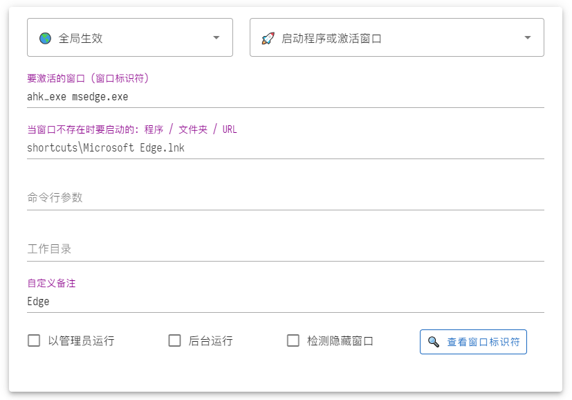
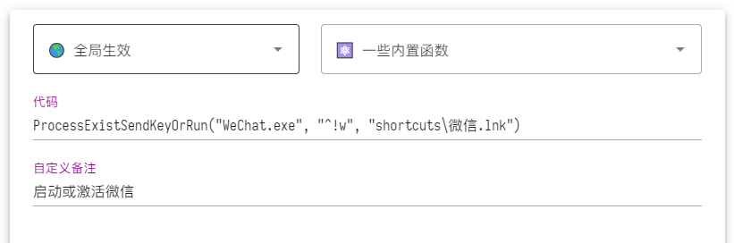
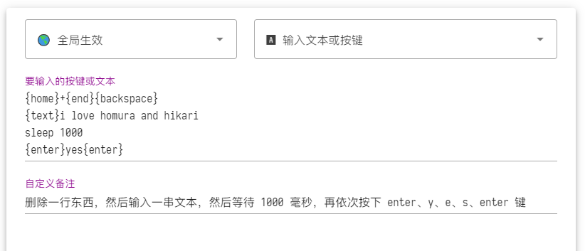
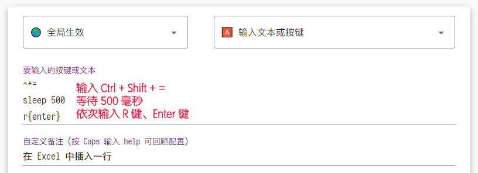

## 😀 欢迎

1. [项目 GitHub](https://github.com/xianyukang/MyKeymap)
2. [视频介绍](https://www.bilibili.com/video/BV1Sf4y1c7p8/)
3. [快速入门](https://xianyukang.com/MyKeymap.html#mykeymap-%E7%AE%80%E4%BB%8B) ( 推荐看看，能了解 MyKeymap 的功能，和注意事项 )

## ✨ 浏览器字体

1. 可以美化浏览器字体，因为字体文件占几十 M 所以不打包在 MyKeymap 里面
2. 效果对比: 「 [修改前](/font-compare/1.png) / [修改后](/font-compare/2.png) 」， 「 [修改前](/font-compare/3.png) / [修改后](/font-compare/4.png) 」， 「 [修改前](/font-compare/5.png) / [修改后](/font-compare/6.png) 」
3. 如何修改: ①[去这下载工具](https://www.bilibili.com/video/BV1pP4y187bR/) ②把其中的常用字体全部装上 ③[从这跟着视频](https://www.bilibili.com/video/BV1pP4y187bR?t=190.0)一步一步操作

## 🚀 启动程序或激活窗口 

### 概述

- 此功能用来启动程序或激活窗口，其中「 激活窗口 」是亮点
- 因为程序往往只启动一次，但却要激活它的窗口几十上百次
- 如果切换到目标窗口要耗费 2 秒以上，花两秒多才能找到想要的窗口，那么这个程序算不上完全启动
- 因为用户体验和没启动是一样的，都是必须等 2 秒，然后才能开始工作

### 搜索型启动器的局限

- 基于模糊搜索的启动器 ( 比如开始菜单 ) 确实很方便，但在面对「 常用软件 」时，它们还不够方便:
  1. 模糊搜索具有模糊性，需要担心和处理不匹配的情况，而快捷键是精准确定的，无脑按就行
  2. 模糊搜索消耗的按键次数更多，至少要按 5 个键才能启动，而快捷键只需 1/2/3 个键
  3. 它们只管启动程序，不管激活窗口，缺乏激活窗口的能力，而激活窗口的频率要比启动频率高得多

### 如何配置

1. 先填第 2 个输入框，可以填「 程序路径 / 文件夹路径 / 网页链接 / PATH 中的命令 / 魔法链接 (参见后文) 」 
   - MyKeymap 会把开始菜单中的快捷方式复制到 shortcuts 目录，用来做自动补全
   - 对于不在开始菜单中的程序，要填完整路径，比如 `D:\tools\神奇小程序\nirsoft\NirLauncher.exe`
   - 可以用 `Capslock + Z` 复制选中文件的路径
2. 填完第 2 个输入框点左下角的「 保存 」，然后按一下当前热键，试试看能否成功启动
3. 程序启动后点一下「 查看窗口标识符 」，然后把程序的窗口标识符 ( 比如 `ahk_exe msedge.exe` ) 填到第 1 个输入框

> - `命令行参数` 和 `工作目录` 供有需要的人使用，一般不用填
> - `后台运行` 会隐藏程序的主窗口，一些命令行程序在启动时会弹出一个黑框，可以用这个隐藏黑框
> - 如果需要激活其他虚拟桌面的窗口，可以勾选 `检测隐藏窗口` ( 不勾也行，有的程序遇到重复启动会自动激活旧实例 )

 

### 用官方热键进行激活

- 像 QQ 和微信这些挂在后台的程序，需要用它们的官方热键进行激活
- 比如 QQ 要按 Ctrl + Alt + Z 进行激活，微信要按 Ctrl + Alt + W 激活
- 可以使用图中的函数:
  - ProcessExistSendKeyOrRun("WeChat.exe", "^!w", "shortcuts\微信.lnk")
  - 它的含义如下:
  - 如果 `WeChat.exe` 进程存在，那么输入 `^!w` (表示 Ctrl+Alt+W 热键) 激活微信，否则启动微信

 

### 魔法链接

- 众所周知，在程序路径中填 https://example.com/ 能让浏览器打开指定的网页
- 这个 `https:` 是一种 URI Scheme，可以让相关程序执行特定动作，除了 `https:` 还有其他格式的链接，比如:
  - 用 `shell:Downloads` 让文件资源管理器打开「 下载 」文件夹
  - 用 `shell:RecycleBinFolder` 让文件资源管理器打开「 回收站 」文件夹
  - 用 `ms-settings:bluetooth` 让 Windows 设置打开「 蓝牙 」页面
  - 用 `ms-settings:startupapps` 让 Windows 设置打开「 自启 」页面
  - 用 `steam://rungameid/1687950` 让 Steam 启动「 女神异闻录5 」游戏
  - 用 `mailto:homura@xb2.com` 让邮件客户端为「 homura 」创建一封邮件
- 其中打开「 特殊文件夹 」和「 特定设置页 」比较常用，可以参考:
  - [文件资源管理器 ( shell: )](https://www.elevenforum.com/t/list-of-windows-11-shell-commands-for-shell-folder-shortcuts.1080/)
  - [Windows 设置 ( ms-settings: )](https://learn.microsoft.com/en-us/windows/uwp/launch-resume/launch-settings-app#ms-settings-uri-scheme-reference)

### 关于 {selected}

- 可以用 {selected} 表示选中的文本或文件，它的作用和用法参考「 Capslock 命令 」中的:
  - `cc` 用 VS Code 打开选中的文件或文件夹
  - `wt` 用 Windows Terminal 打开选中的文件夹
  - `bb` 用 Bing 词典搜索选中的文本 ( 低配版划词翻译 )
  - 在命令行中，使用空格分隔参数，而文件路径也有可能包含空格，会产生歧义。推荐用双引号去除歧义，比如 `"{selected}"`

## 💎 输入文本或按键

### 概述

- 此功能用来输入一串按键或文本，常用于:
  1. 重映射不好按的快捷键: 比如用 Capslock+X 来触发 Alt+F4，能让快捷键变得更好按
  2. 通过输入一串按键实现各种各样的目的: 
     - 比如用 Capslock+D 来输入 Home、Shift+End、Backspace，能删除一行文本
     - 比如用 Capslock+R 来输入 Win+X、U 、R，能重启电脑

### 如何配置

- 首先要把输入法切换到英文状态，因为接下来用到的标点符号，全都必须是「 英文标点符号 」!
- 下图取自 Capslock 模式的 0 键，逐行解释如下:

 

#### ➤ 第一行

- 含义为: 先用 home 键把光标移动到行首，然后用 shift + end 选中一整行，最后按 backspace 删除

- `{home}` 表示 home 键，因为键名超出 1 个字母，所以要用大括号 `{}` 括起来 ( 特殊符号也一样 )
- `+{end}` 表示 shift + end，请记住 `^ ! + #` 这四个特殊符号，它们常用于输入组合键，举个例子:
  - 用 `^a` 表示 ctrl + a
  - 用 `!f` 表示 alt + f
  - 用 `#s` 表示 win + s
  - 用 `!{f4}` 表示 alt + f4
  - 用 `^+{esc}` 表示 ctrl + shift + esc，能启动任务管理器
  - 用 `^!{tab}` 表示 ctrl + alt + tab，能打开窗口切换器

#### ➤ 第二行

- `{text}i love homura` 中的 `{text}` 表示以文本模式输入后面的内容，区别如下:
  - 使用 `love` 时，会依次输入 l、o、v、e 等 4 个按键
  - 使用 `{text}love` 时，会输入 `love` 这样一段文本，不受输入法中英文状态的影响

#### ➤ 第三行

- `sleep 1000` 表示等待 1000 毫秒，有时候要等程序处理完一组按键，再输入下一组按键，比如:

 

